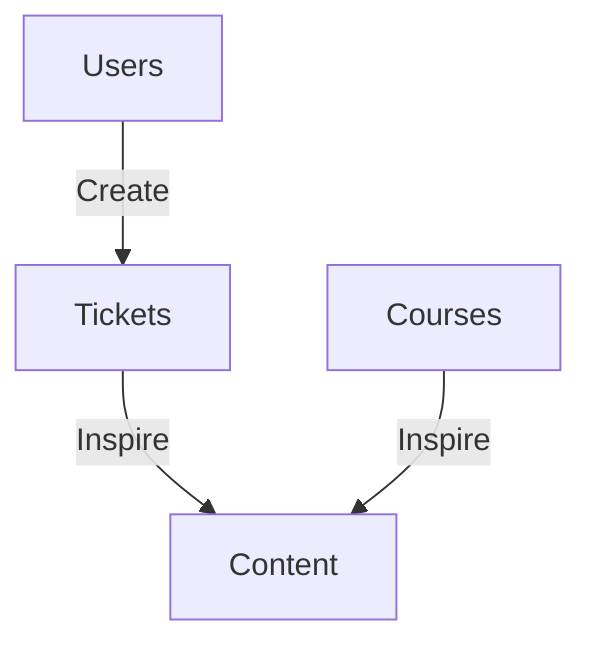
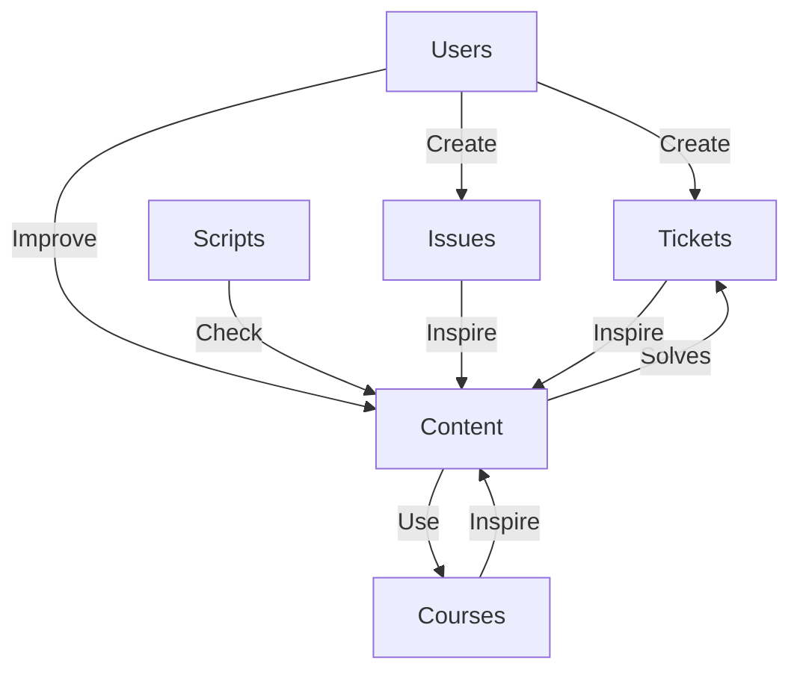
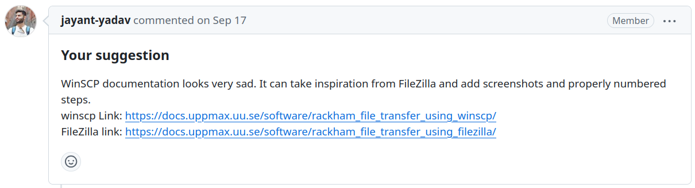
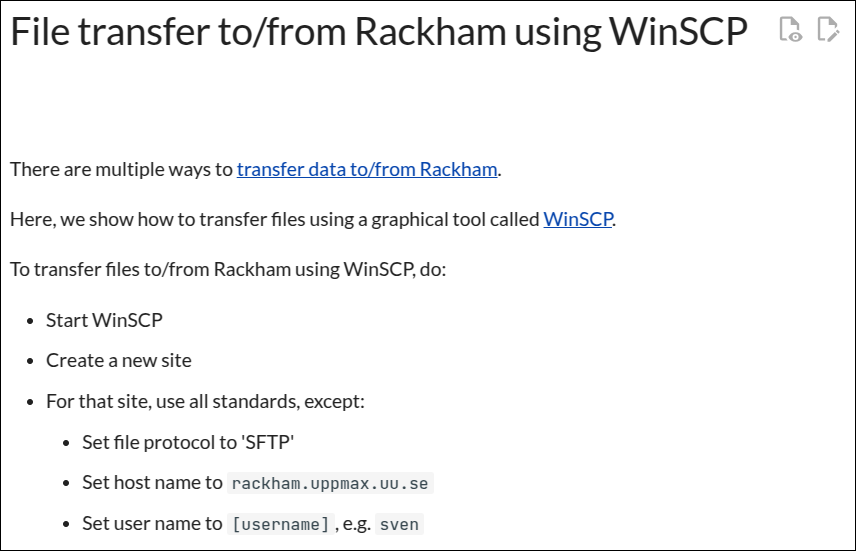
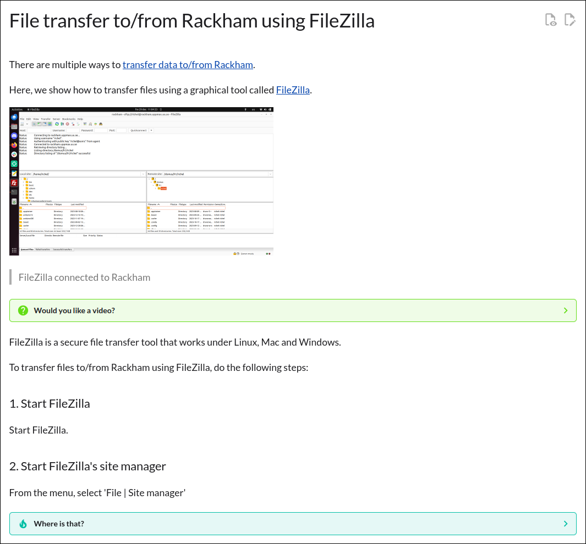

# User documentation: high quality, efficient workflow, while caring for our users

My presentation at the NBIS retreat on 2025-03-13.

## Draft

### Goal

To show how awesome the UPPMAX documentation is

### History

Created 2022-11-10 by Matias Piqueras,
with Björn Claremar starting at 2023-01-13.

### Now

Humans:

- 8 Contributors
- 2,346 commits
- 21 Pull Requests by 6 people
- 132 issues, of which 101 closed
- 67 YouTube videos
    - Connect to SweStore: 377 views
    - Migration to Dardel: 281 views
    - Rackham using local ThinLinc client: 139 views
- A Code of Conduct
- A document on how to contribute 

Content:

- 708 pages
- 87 pages with tags
- 532 drop-down boxes
- 339 images
- 35,416 lines
- 2,125 internal links

Scripts:

- 5 continuous integration scripts, by 4 people

Script name     |Description
----------------|-------------------------------------------------
`check_bash`    |Checks if bash scripts follow a recommended style
`check_links`   |Checks if all links are valid
`check_markdown`|Checks if pages content follows a recommended style
`check_spelling`|Checks is spelling is correct
`create_website`|Creates and deploys the website

## Example change

### Issue

> [Issue 129](https://github.com/UPPMAX/UPPMAX-documentation/issues/129)

### Old

> [WinSCP page](https://docs.uppmax.uu.se/software/rackham_file_transfer_using_winscp/)

### New

> [FileZilla page](https://docs.uppmax.uu.se/software/rackham_file_transfer_using_filezilla/)

## Changes

It shows we care about quality:

- The documentation is good enough to be used in courses,
  where courses ensure the documentation is kept up-to-date

It shows we care about efficiency:

- The documentation is good enough to solve tickets
  by sending one URL,
  where tickets inspire to improve the documentation

It shows we care about users:

- Uses can create issues,
  which are discussed in the documentation meetings
- Users can submit changes via a Pull Request, 
  which are discussed in the documentation meetings
- Each page has an icon that allows a user to propose changes
- We detect as much mistakes as possible automatically

We know we do a good job:
- When asked if documentation is clear, it usually is.
  - When not, the documentation is updated :-)
- We get compliments from users in courses for having
  such clear documentation
  - Also: people migrating to Dardel complain about
    the PDC documentation
